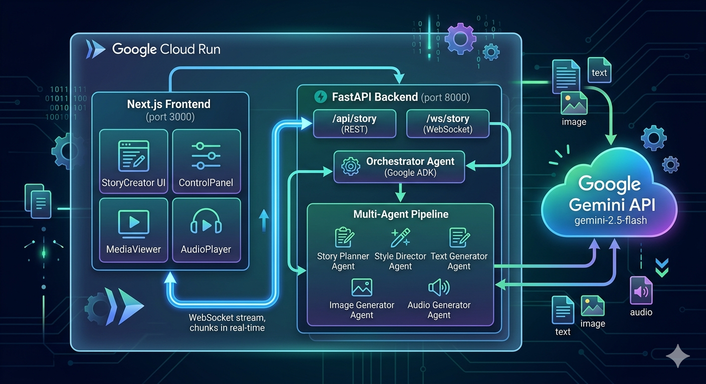

# Future Artist — Creative Storyteller AI Agent

> Gemini Live Agent Challenge 2026 · Track: Creative Storyteller ✍️

Future Artist is a multimodal AI storytelling platform. Give it a topic, a tone, and a target audience — it generates a complete story with text, AI-illustrated images, and narrated audio streamed in real time.

**Built with Google Gemini 2.5 Flash · Google ADK · FastAPI · Next.js 14**

---

**Live demo**: [futureartist-frontend-226638196775.us-central1.run.app](https://futureartist-frontend-226638196775.us-central1.run.app)
**Demo video**: _(add YouTube/Drive link — required by hackathon, max 4 min)_

| Mode                 | What you get                                        |
| -------------------- | --------------------------------------------------- |
| Children's Storybook | Cartoon illustrations + playful narration per scene |
| Marketing Campaign   | Brand visuals + inspiring structured copy           |
| Educational          | Clean diagrams + professional tone                  |

---

## System Architecture



```
┌─────────────────────────────────────────────────────────────────┐
│                        Google Cloud Run                         │
│                                                                 │
│  ┌──────────────────────┐        ┌───────────────────────────┐  │
│  │   Next.js Frontend   │        │    FastAPI Backend         │  │
│  │   (port 3000)        │        │    (port 8000)             │  │
│  │                      │        │                            │  │
│  │  StoryCreator UI     │◄──────►│  /api/story (REST)         │  │
│  │  ControlPanel        │        │  /ws/story  (WebSocket)    │  │
│  │  MediaViewer         │        │                            │  │
│  │  AudioPlayer         │        │  ┌─────────────────────┐  │  │
│  └──────────────────────┘        │  │  Orchestrator Agent  │  │  │
│         ▲  WebSocket stream      │  │  (Google ADK)        │  │  │
│         │  chunks in real-time   │  └──────────┬──────────┘  │  │
│         └──────────────────────────────────────┘             │  │
│                                  │           │                │  │
│                                  │    ┌──────▼──────────────┐ │  │
│                                  │    │  Multi-Agent Pipeline│ │  │
│                                  │    │                      │ │  │
│                                  │    │ Story Planner Agent  │ │  │
│                                  │    │ Style Director Agent │ │  │
│                                  │    │ Text Generator Agent │ │  │
│                                  │    │ Image Generator Agent│ │  │
│                                  │    │ Audio Generator Agent│ │  │
│                                  │    └──────────┬───────────┘ │  │
└─────────────────────────────────────────────────│───────────────┘
                                                   │
                                    ┌──────────────▼──────────────┐
                                    │        Google Gemini API     │
                                    │                              │
                                    │  gemini-2.5-flash            │
                                    │  ├─ Text generation          │
                                    │  └─ Image generation         │
                                    └─────────────────────────────┘
```

**Request flow:**

1. User fills the form and clicks Generate
2. Frontend opens a **WebSocket** connection to the backend
3. Backend **Orchestrator** (Google ADK) kicks off the agent pipeline
4. Each agent calls **Gemini API** and streams results back through the Orchestrator
5. Backend sends chunks over WebSocket as they arrive — `text`, `image`, `audio` typed
6. Frontend renders each chunk inline as it streams — story builds in real time

## Agent Pipeline

```
User Request
    └─► Story Planner      — narrative structure, scene breakdown, character bios
        └─► Style Director  — visual style guide, color palette, character consistency rules
            └─► Text Generator  — scene-by-scene story text (streamed)
            └─► Image Generator — scene illustrations via Gemini image generation (streamed)
            └─► Audio Generator — narration config; browser reads full text via Web Speech API
```

---

## Tech Stack

| Layer           | Technology                                    |
| --------------- | --------------------------------------------- |
| AI Model        | Gemini 2.5 Flash (text + image generation)    |
| Agent Framework | Google ADK (Agent Development Kit)            |
| Backend         | Python 3.11, FastAPI, Uvicorn                 |
| Frontend        | Next.js 14, TypeScript, Tailwind CSS          |
| Streaming       | WebSocket (real-time chunk delivery)          |
| TTS             | Web Speech API (browser-native, tone-matched) |
| Hosting         | Google Cloud Run (us-central1)                |

---

## Local Setup

### Prerequisites

- Python 3.11+
- Node.js 18+
- A Gemini API key — get one free at [aistudio.google.com/apikey](https://aistudio.google.com/apikey)

### 1. Clone

```bash
git clone https://github.com/stevenchendan/futureArtist.git
cd futureArtist
```

### 2. Backend

```bash
cd backend

# Create and activate virtual environment
python -m venv venv
source venv/bin/activate        # macOS/Linux
# venv\Scripts\activate         # Windows

# Install dependencies
pip install -r requirements.txt

# Configure environment
cp .env.example .env
```

Open `backend/.env` and set your API key — this is the **only required change**:

```env
GEMINI_API_KEY=your-gemini-api-key-here
```

Start the backend:

```bash
python -m app.adk.main
```

Confirm it's running:

```bash
curl http://localhost:8000/health
# → {"status":"healthy","services":{"gemini":"connected","storage":"connected"}}
```

### 3. Frontend

Open a **new terminal** from the repo root:

```bash
cd futureArtist/frontend   # or just: cd ../frontend if you're still in backend/
npm install
npm run dev
```

The frontend connects to `http://localhost:8000` by default. No `.env.local` changes needed.

Open **[http://localhost:3000](http://localhost:3000)**

---

## Reproducible Test Scenarios

### Scenario A — Children's Storybook

| Field           | Value                                                    |
| --------------- | -------------------------------------------------------- |
| Story Topic     | `A brave little robot who gets lost in a magical forest` |
| Story Type      | `Storybook`                                              |
| Tone            | `Playful`                                                |
| Target Audience | `Children`                                               |
| Visual Style    | `Cartoon`                                                |
| Include         | Text + Images + Audio                                    |

Expected: Multi-scene illustrated storybook with cartoon images inline, audio player per scene, and Reading Mode button.

### Scenario B — Marketing Campaign

| Field           | Value                                                                |
| --------------- | -------------------------------------------------------------------- |
| Story Topic     | `Launching a sustainable coffee brand for eco-conscious millennials` |
| Story Type      | `Marketing`                                                          |
| Tone            | `Inspiring`                                                          |
| Target Audience | `Young Adults`                                                       |
| Visual Style    | `Modern`                                                             |
| Include         | Text + Images                                                        |

Expected: Structured marketing copy with on-brand visuals.

### Scenario C — Educational Explainer

| Field           | Value                                        |
| --------------- | -------------------------------------------- |
| Story Topic     | `How the human immune system fights viruses` |
| Story Type      | `Educational`                                |
| Tone            | `Professional`                               |
| Target Audience | `General Public`                             |
| Visual Style    | `Minimalist`                                 |
| Include         | Text + Images                                |

Expected: Clear, well-structured educational narrative with clean illustrations.

### What to Verify

- [ ] Content streams progressively — text and images appear as each scene completes
- [ ] Images match the scene and visual style selected
- [ ] Audio player reads the full story text aloud with tone-matched rate/pitch
- [ ] **Reading Mode** — distraction-free full-width reading view, exits cleanly

---

## Environment Variables

### Backend (`backend/.env`)

| Variable               | Required | Default            | Description                                    |
| ---------------------- | -------- | ------------------ | ---------------------------------------------- |
| `GEMINI_API_KEY`       | **Yes**  | —                  | Gemini API key from AI Studio                  |
| `GEMINI_MODEL`         | No       | `gemini-2.5-flash` | Model to use                                   |
| `GOOGLE_CLOUD_PROJECT` | No       | —                  | GCP project (only needed for Cloud deployment) |
| `PORT`                 | No       | `8000`             | Server port                                    |
| `ALLOWED_ORIGINS`      | No       | `*`                | CORS origins                                   |

### Frontend (`frontend/.env.local`)

| Variable              | Default                 | Description           |
| --------------------- | ----------------------- | --------------------- |
| `NEXT_PUBLIC_API_URL` | `http://localhost:8000` | Backend HTTP URL      |
| `NEXT_PUBLIC_WS_URL`  | `ws://localhost:8000`   | Backend WebSocket URL |

---

## Google Cloud Deployment

```bash
# Backend
cd backend
gcloud run deploy futureartist-backend \
  --source . \
  --region us-central1 \
  --allow-unauthenticated \
  --set-env-vars GEMINI_API_KEY=your-key,GEMINI_MODEL=gemini-2.5-flash

# Frontend
cd frontend
gcloud run deploy futureartist-frontend \
  --source . \
  --region us-central1 \
  --allow-unauthenticated
```

---

## Project Structure

```
futureArtist/
├── backend/
│   └── app/
│       ├── adk/            # ADK entry point & config
│       ├── agents/         # Story Planner, Style Director, Text/Image/Audio Generators
│       ├── api/            # FastAPI routes & WebSocket handler
│       └── models/         # Pydantic data models
└── frontend/
    └── src/
        └── components/
            ├── StoryCreator/   # Main creation form
            ├── MediaViewer/    # Streaming content renderer + AudioPlayer
            └── ControlPanel/   # Style, tone, audience controls
```

---

## Team

Steven (Liang) Chen · Kuan Yu

Built for the **Gemini Live Agent Challenge 2026** — Creative Storyteller Track

_This content was created for the purposes of entering the Gemini Live Agent Challenge hackathon. #GeminiLiveAgentChallenge_

---

## License

MIT — see [LICENSE](LICENSE)
